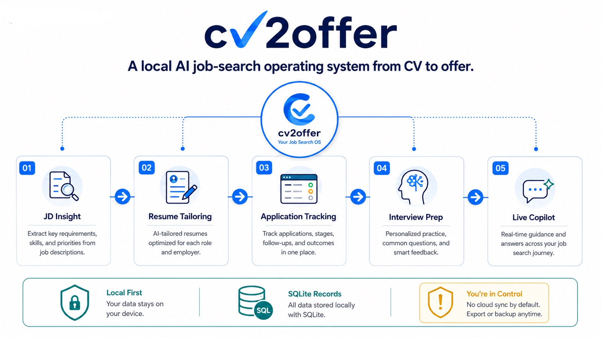
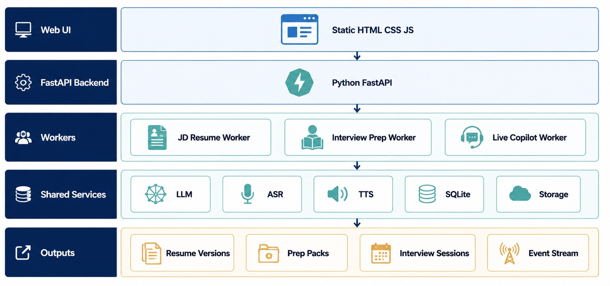
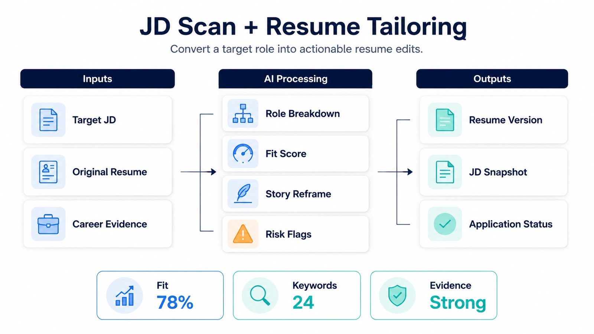
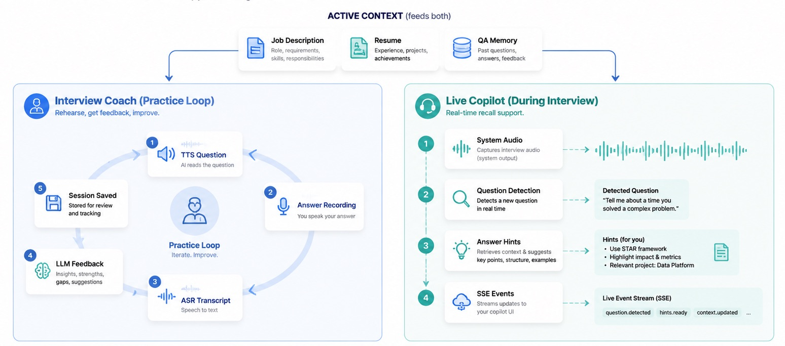
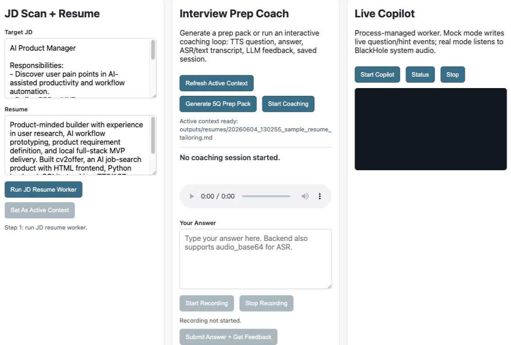
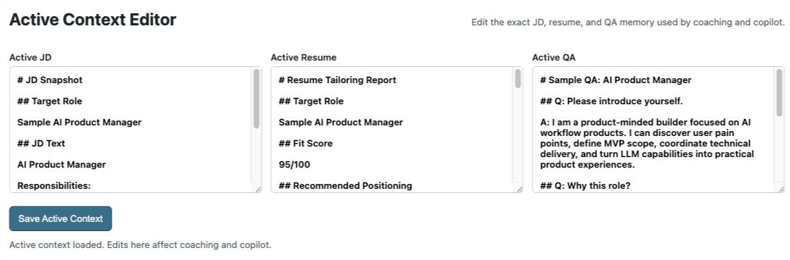
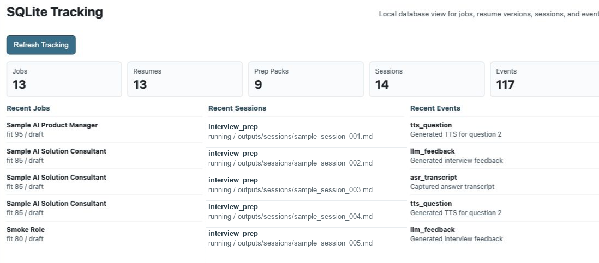

# cv2offer

An AI job-search operating system that turns a candidate's resume and career evidence into a trackable path from CV to offer.

`cv2offer` is designed as a local-first product: simple enough to run on a laptop, but structured enough to support a real job-search workflow. It covers JD scanning, resume tailoring, application tracking, interview preparation, and live interview assistance.



## Why This Exists

Most job-search tools stop at resume generation. Real job search is a pipeline:

1. Find and understand JDs
2. Match the JD against real career evidence
3. Tailor the resume
4. Track applications and feedback
5. Prepare for interviews
6. Get real-time recall support during interviews

`cv2offer` packages that workflow into a local, privacy-aware product.

## Architecture

The frontend stays intentionally simple: static HTML, CSS, and JavaScript.

The backend is Python-based and split into three workers:



```text
web/index.html
  -> server/app.py
      -> workers/jd_resume/
      -> workers/interview_prep/
      -> workers/interview_copilot/
```

The user-facing workflow has five stages, but the runtime architecture starts with three worker modules:

| Worker | Purpose |
| --- | --- |
| `workers/jd_resume/` | Scan JD, parse role, score fit, tailor resume, write application state |
| `workers/interview_prep/` | Generate prep packs and run an interactive coaching loop: TTS question, answer transcript, LLM feedback, saved session |
| `workers/interview_copilot/` | Process-managed live assistant: mock realtime events now; real mode captures BlackHole system audio, ASR transcript, answer hints |

The frontend should let users enter any major capability directly:

- JD scan and resume tailoring
- Interview preparation:
  - generate a prep pack as a durable output
  - start a coaching session that reads questions aloud, records or accepts answers, gives feedback, and saves the session
- Live interview copilot:
  - start/stop a process-managed assistant for interview-time question detection and answer hints

Interview preparation and live copilot should still be bound to context. A prep pack or copilot session should reference the target JD, resume version, and QA pack or base QA notes used for that opportunity.

For the first version, interview preparation does not need to choose all inputs from SQLite. Use a fixed editable context folder:

```text
context/
  active_jd.md
  active_resume.md
  active_qa.md
  active_context.json
```

This makes it easy to manually edit the JD, resume, and QA before an interview. SQLite can still record generated outputs, snapshots, progress status, and sessions.

Resume generation and interview preparation are connected by an explicit promotion step:

```text
outputs/resumes/generated_resume.md
  -> Set as active interview context
  -> context/active_resume.md
  -> workers/interview_prep/
```

The user should not need to manually copy files. The app should provide a "Set as active context" action that copies the chosen generated resume and JD into `context/`, then writes source metadata to `context/active_context.json`.

## Core Workflows

### JD Scan And Resume Tailoring

The first worker converts a target JD and resume into structured role analysis, fit scoring, risk flags, and a generated resume version that can be promoted into active interview context.



### Interview Prep And Live Copilot

The second and third workers share the same active JD, resume, and QA memory. Interview prep is a practice loop with TTS, recording, ASR, feedback, and saved sessions; live copilot is the during-interview loop for system-audio question detection and answer hints.



## Current MVP Status

Implemented now:

- Local FastAPI server on port `8765`
- Static HTML frontend served by Python
- `jd_resume` in-process worker
- JD snapshot output in `outputs/jds/`
- Resume-tailoring output in `outputs/resumes/`
- SQLite tracking for jobs, resume versions, prep packs, sessions, and events
- SQLite Tracking panel showing local database counts and recent jobs/sessions/events
- Explicit "Set as active context" promotion into `context/`
- Active Context Editor for reviewing and editing the exact JD, resume, and QA used by coaching and copilot
- `interview_prep` in-process worker that generates a 5-question mock prep pack
- Interactive interview coaching session: TTS question audio, answer transcript, LLM feedback, saved Markdown session
- Browser recording controls for interview answers; typed answers are also supported
- `interview_copilot` process-managed worker with mock realtime question/hint events
- Copilot frontend subscribes to live events through SSE/EventSource, with polling fallback
- Real-mode copilot path for BlackHole system-audio capture, StepFun ASR, and DeepSeek answer hints
- Runtime readiness checks for provider keys and local audio input devices
- Pytest coverage for context promotion, SQLite, worker boundaries, mock mode, and process manager

Real-mode notes:

- Real provider mode requires user-provided DeepSeek and Stepfun API keys.
- Live copilot real mode was designed for macOS and requires BlackHole plus a configured Audio MIDI Setup multi-output device.
- Full polished realtime copilot display; current UI streams events but is still a simple log view

## Application Screenshots

### Workbench Overview



### Active Context Editor



### SQLite Tracking



## Quick Start

Create a local virtual environment and install dependencies:

```bash
cd cv2offer
python3 -m venv .venv
.venv/bin/python -m pip install -r requirements.txt
```

For a local demo without external API calls, create `.env` and enable mock mode:

```bash
cp .env.example .env
```

Edit `.env`:

```text
CV2OFFER_MOCK=1
```

Start the app:

```bash
.venv/bin/python server/app.py
```

Then open:

```text
http://127.0.0.1:8765
```

For real LLM/ASR/TTS calls, set `CV2OFFER_MOCK=0` and fill in the provider keys documented in `.env.example`.

## macOS Audio Routing

The real live-copilot path is designed and tested around a macOS audio setup. It uses BlackHole as a virtual audio input and macOS Audio MIDI Setup to create a multi-output device, so interview audio can still play through speakers or headphones while also being routed into the copilot worker for ASR.

Typical real-mode routing:

```text
Meeting audio
  -> macOS Multi-Output Device
      -> headphones or speakers
      -> BlackHole virtual input
  -> interview_copilot worker
  -> Stepfun ASR
  -> DeepSeek answer hints
  -> frontend event stream
```

In mock mode, this audio setup is not required. For real mode, set `COPILOT_AUDIO_DEVICE=BlackHole` in `.env` and use `Runtime Checks` or `scripts/verify_runtime.py --require-real` to confirm the device is visible.

## How To Use The Local UI

Start the backend, then open `http://127.0.0.1:8765`. Do not open `web/index.html` directly, because the HTML needs the Python API.

The page has three independent product entries:

- `JD Scan + Resume`: creates a JD snapshot and resume-tailoring output. Use `Set As Active Context` when that JD/resume should become the source for interview prep and copilot.
- `Interview Prep`: use `Generate Interview Prep` for the prep-pack artifact, and use `Start Coaching` for the real coaching loop: TTS question -> answer by text or recording -> ASR transcript -> LLM feedback -> saved session.
- `Live Copilot`: starts the process-managed interview-time assistant. In mock mode it emits realtime sample question/hint events over SSE; in real mode it expects BlackHole plus provider keys.
- `Runtime Checks`: reports whether the app is in mock mode, whether provider keys are present, and whether the preferred system-audio input device is visible.

## Demo Flow

Use this flow to try the local product loop:

1. Paste the sample AI Product Manager JD and sample resume into `JD Scan + Resume`.
2. Click `Run JD Resume Worker` to create a JD snapshot, resume-tailoring report, SQLite job row, and progress events.
3. Click `Set As Active Context` so interview prep and copilot use the generated JD/resume plus QA memory.
4. Review or edit `Active JD`, `Active Resume`, and `Active QA` in the `Active Context Editor`.
5. Click `Generate 5Q Prep Pack` to create a durable interview-prep artifact.
6. Click `Start Coaching`, listen to the question audio, answer by text or recording, and review transcript plus LLM feedback.
7. Click `Start Copilot` to start the process-managed live assistant and stream question/hint events.
8. Click `Refresh Tracking` to show SQLite counts and recent jobs, sessions, and events.

## Providers

```text
server/services/
  context_service.py
  llm_service.py
  asr_service.py
  tts_service.py
  sqlite_service.py
  storage_service.py
```

Provider configuration lives in `.env.example`, which is the single source of truth for provider names, model names, API base URLs, and environment variables.

The first version needs a DeepSeek API key for LLM calls and a Stepfun API key for ASR/TTS. Read current provider defaults from `.env.example`.

Official provider docs:

- LLM: [DeepSeek API Docs](https://api-docs.deepseek.com/zh-cn/)
- ASR: [StepAudio 2.5 ASR](https://platform.stepfun.com/docs/zh/guides/models/stepaudio-2.5-asr)
- TTS: [StepAudio 2.5 TTS](https://platform.stepfun.com/docs/zh/guides/models/stepaudio-2.5-tts)

SQLite is required, not optional. It is used to track JD records, generated resume versions, application statuses, interview-prep packs, mock sessions, and live copilot sessions.

The key data relationships are:

- one JD can have many resume versions
- one resume version can have many interview-prep packs
- one interview-prep pack can have many mock interview sessions
- one JD/resume/QA context can have many live copilot sessions

TTS is required for interview preparation because the mock interview flow should read questions aloud.

## Decoupling Rules

- `server/app.py` only exposes HTTP routes, serves the frontend, and routes requests.
- `workers/jd_resume/` and `workers/interview_prep/` are in-process FastAPI calls in the MVP.
- `server/process_manager.py` is only for long-running worker processes such as `workers/interview_copilot/`.
- Each worker has its own folder, entrypoint, service code, data models, and README.
- Workers should not import each other's internals.
- Shared LLM, ASR, TTS, SQLite, and storage code belongs in `server/services/`.
- Each worker should be runnable or testable from the command line without the frontend.

## Suggested Directory

```text
cv2offer/
  README.md
  requirements.txt
  .env.example
  .gitignore

  web/
    index.html
    app.js
    style.css

  context/
    active_jd.md
    active_resume.md
    active_qa.md
    active_context.json

  server/
    app.py
    events.py
    process_manager.py
    workers/
      jd_resume/
        __init__.py
        main.py
        service.py
        models.py
        README.md
      interview_prep/
        __init__.py
        main.py
        service.py
        models.py
        README.md
      interview_copilot/
        __init__.py
        main.py
        service.py
        models.py
        README.md
    services/
      context_service.py
      llm_service.py
      asr_service.py
      tts_service.py
      sqlite_service.py
      storage_service.py
    db/
      schema.sql
      cv2offer.sqlite

  outputs/
    resumes/
    interview_50q/
    sessions/

  examples/
    sample-jd.md
    sample-resume.md
    sample-qa.md
    sample-output.md

  docs/
    test-cases.md
    product-brief.md
    system-architecture.md
    workflow.md
    demo-script.md
```

## Important Outputs

- `outputs/resumes/`: resume versions generated from a resume and target JD.
- `outputs/interview_50q/`: 50-question interview-prep packs generated from resume, JD, and expected interview focus.
- `outputs/sessions/`: mock interview transcripts, answer feedback, and live copilot notes.

## Local References

This project is an integration layer around existing local work:

- `<private-upstream>/chrisCV`: JD matching, resume tailoring, application tracker
- `<private-upstream>/interviewQA`: mock interview and interview coaching
- `<private-upstream>/interviewCoPilot`: live interview copilot

For a public GitHub release, use sanitized examples instead of private resume data, real JD URLs, API keys, or private tracker records.

## What It Does

The current product can:

1. Start a Python backend and serve the local HTML app.
2. Submit a target JD and resume.
3. Generate a JD snapshot, fit analysis, and resume-tailoring output.
4. Promote a generated JD/resume into editable active context.
5. Generate an interview-prep pack from the active context.
6. Run a coaching session with TTS questions, answer capture, ASR transcript, LLM feedback, and saved notes.
7. Start a process-managed live copilot stream for interview-time question and hint events.
8. Track jobs, resume versions, prep packs, sessions, and progress events in SQLite.

The next product focus is real-provider hardening, BlackHole device validation, and a cleaner live transcript/hint interface for the copilot flow.

## Tests

MVP test cases live in [docs/test-cases.md](docs/test-cases.md). They cover context promotion, SQLite initialization, worker boundaries, in-process versus process-managed worker behavior, frontend entries, and output generation.

Run the automated test suite:

```bash
.venv/bin/python -m pytest -q
```

## Local Port

Use port `8765` by default to avoid common development ports such as `8000`.

```bash
.venv/bin/python server/app.py
```

Then open:

```text
http://localhost:8765
```

If the port is occupied, override it with:

```bash
CV2OFFER_PORT=9876 .venv/bin/python server/app.py
```

## Environment

Copy `.env.example` to `.env` for local development:

```bash
cp .env.example .env
```

Required first-version keys are documented in `.env.example`. At minimum, copy the file and fill in the API keys before enabling real provider calls.

See `.env.example` for the full provider variable list.

For local tests and demos without network calls, set `CV2OFFER_MOCK=1`.

Before a real-provider or real-device run, use:

```bash
python3 scripts/verify_runtime.py --require-real
```

This checks key presence and the preferred audio input device without printing secret values.

Then run the opt-in real smoke checks:

```bash
CV2OFFER_MOCK=0 python3 scripts/smoke_real_flows.py --mode interview-prep
CV2OFFER_MOCK=0 python3 scripts/smoke_real_flows.py --mode copilot
```

The interview-prep smoke uses active context, real TTS, real ASR, real LLM feedback, and writes a session. The copilot smoke injects one spoken test question into BlackHole by default, captures it as system audio, transcribes it, and generates one answer hint. Use `--no-inject-test-audio` if you want to capture whatever is already playing through BlackHole.

For the first real copilot run, `COPILOT_SEGMENT_SECONDS=8` is recommended because it captures fuller interviewer questions. Lower it later if you prefer lower latency.

## Privacy And Repository Hygiene

`cv2offer` is local-first. Runtime data, generated outputs, and credentials should stay outside version control.

- Use `.env.example` for configuration examples; keep real `.env` files local.
- Keep `.venv/`, `outputs/`, SQLite database files, and active context files out of Git.
- Keep public examples under `examples/` and `context/*.example.md` sanitized.
- Review screenshots before sharing them to make sure they do not show private resume data, real JD URLs, or API keys.

## License

MIT License. See [LICENSE](LICENSE).
